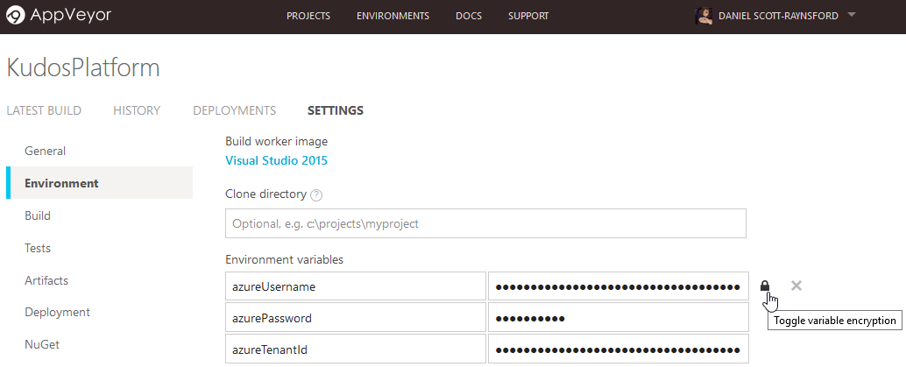

# KudosPlatform

[](https://waffle.io/IAG-NZ/KudosPlatform)
[](https://gitter.im/KudosPlatform/Lobby?utm_source=badge&utm_medium=badge&utm_campaign=pr-badge&utm_content=badge)
[](https://ci.appveyor.com/project/IAG-NZ/kudosplatform/branch/master)

The IAG-NZ Dev Guild KudosPlatform for gamifying Yammer.

## Requirements

To work with this project you will need to have installed:

1. Windows Management Framework 5.0:
   - Windows 10/Windows Server 2016 - already installed.
   - Earlier Windows versions - [from this location](https://www.microsoft.com/en-us/download/details.aspx?id=50395).
2. Visual Studio 2015 (Community, Pro or Enterprise):
   - Community can be downloaded and installed free [from this location](https://www.visualstudio.com/vs/community/).
3. An Azure account with a valid subscription:
   - If you have an MSDN account then you will be able to use this to get a free Azure subscription with a free monthly credit allowance.
4. Your Azure subscription must contain an Azure Active Directory:
   - It will have a default one if you haven't deleted it.
   - This is required to create a service principal for the PowerShell automation to use to install this project.
   - See [this page](https://docs.microsoft.com/en-us/azure/azure-resource-manager/resource-group-authenticate-service-principal) for more information.

## Getting Started

This section will detail the steps required to get started with working on this project.

To be completed...


## PSake

This project includes a [PSake](https://github.com/psake/psake) file that defines tasks for initializing the development/build environment, building, installing and deploying the project.

To use the PSake file (default.ps1), you will need to install PSake.

> To install PSake:

1. At an Administrator Windows PowerShell console enter:

```PowerShell
Install-Module -Name PSake
```

### PSake Tasks

These are the tasks contained in the PSake file and can be executed once PSake has been installed.
Some tasks allow optional parameters to be provided and these are documented in the tasks and the following section.

#### Init

The _Init_ task will initialize the build or development environment:

```PowerShell
Invoke-PSake Init
```

> Note: This task could take over 10 minutes to complete, but only needs to be performed once on a node.

#### Clean

The _Clean_ task will clean the build environment:

```PowerShell
Invoke-PSake Clean
```

#### Build

The _Build_ task will build the project:

```PowerShell
Invoke-PSake Build
```

#### Install

The _Install_ task will build the project and then install it to Azure.
Azure credentials will need to be provided:

```PowerShell
Invoke-PSake Install `
  -parameters @{ `
    azureUSername = '03becdd7-3395-4bf2-8eff-528b7dcc9a07'
    azurePassword ='P@ssword!1'
    azureTenantId = 'fef06518-9f81-4cff-946a-083d33dd17db'
  }
```

#### CreateAzureSP

The _CreateAzureSP_ task will create the service principal in Azure AD that will be used as the account to login to Azure to install this project.
This only needs to be done once for any Azure account that will have the KudosPlatform installed to.

```PowerShell
Invoke-PSake CreateAzureSP `
  -parameters @{
    azureADDomain = 'MyAzureAppDomain'
    azurePassword = 'P@ssword!1'
  }
```

#### GetAzureSP

The _GetAzureSP_ task will return service principal name in Azure AD that should be used as the username for an account to login to Azure to install this project.

```PowerShell
Invoke-PSake GetAzureSP
```

### PSake Properties

#### azureUSername

#### azurePassword

#### azureTenantId

#### azureADDomain

## Azure

This project contains a continuous integration/continuous delivery pipeline that will automatically deploy to Azure to run automated testing.
To enable this, you will need to provide AppVeyor (see below) with the details of your Azure account.

### Azure Resource Group

All resources in Azure must exist inside an _Azure Resource Group_.
When the Kudos Platform is deployed to Azure it will either create a _new_ Azure Resource Group in your account or use an _existing_ one.
The _Azure Resource Group_ is created to ensure that the resources for the Kudos Platform are grouped together in a logical fashion.
It also allows security to be defined on the _Azure Resource Group_ as a whole.

There are several properties that will be used by

#### AzureRGName

This is the name of the Azure Resource Group that will be created or used for installing this Kudos Platform to.
This should only contain letters and numbers.
It is recommended the following format is used for this name:

- Name: _kp{AzureEnvironment}rg_

> This does not need to be globally unique - it only needs to be unique within your Azure account.

#### AzureUniqueCode

Each user must define an **azureUniqueCode** for their version of the project.
The **azureUniqueCode** must be a string containing only letters and numbers and is case insensitive.

> _It is recommended that you use your GitHub username as your **azureUniqueCode** as this will help reduce the possiblity of conflicts.
However this could make the resulting names longer than 24 characters, so if this is the case for your GitHub username, then you'll need to use something else._

#### AzureEnvironment

This value represents the environment to deploy to.
You may wish to have multiple Resoruce Groups to deploy to if you're working on different features or just experimenting.
Usually the **AzureEnvironment** will be set to 'test', but if you wish to have some other environment you can set this accordingly.
For example 'exp' for an experimental version.

> If you are installing a production environment then you should used the value 'prod'.

### Azure Resource Group Resources

All resources created inside the Azure Resource Group will follow a standard naming convention to ensure they don't conflict with the same resources from another user also testing this project.

- **Storage Account** - _General Purpose_ Locally Redundant Storage for the Kudos Platform. Name: _kp{AzureEnvironment}{AzureUniqueCode}sa_
- **Function App** - Serverless execution platform using a _Consumption Plan_ and the **storage account** above. Name: _kp{AzureEnvironment}{AzureUniqueCode}fa_
- **App Service Plan** - this is created automatically when the **function app** is created. Name: _{Location}Plan_

### ARM Template

The _ARM Template_ is a Resource Manager Group template that will be used to create Azure Resource Groups containing the resources required for by the _KudosPlatform_.
The _ARM Template_ is defined in a file within the KudosPlatform solution and is used by the PSake Install task to ensure the Azure Resource Group has been created prior to deploying it.

The initial _ARM Template_ was created by defining the _Azure Resource Group_ manually and then exporting it as an _ARM Template_ and adding it to the repository and to the Visual Studio solution.

## AppVeyor

This project contains a continuous integration/continuous delivery pipeline using AppVeyor CI.
It will deploy this project to an Azure account every time it is committed so that tests can be run on it.
To enable this, the KudosPlatform project in your AppVeyor account must be configured with the following environment variables defined:

- **azureUsername** - obtained by running the ```CreateAzureSP``` psake task or by running the ```GetAzureSP``` psake task if ```CreateAzureSP``` has already been run on your Azure account.
- **azurePassword** - should be set when calling the ```CreateAzureSP``` psake task.
- **azureTenantId** - will be displayed when running the ```GetAzureSP``` or ```CreateAzureSP``` psake tasks.

> Important Note: Make sure you enable variable encryption on each of the variables to ensure that they can't be retrieved from your AppVeyor account.

[]

> The following optional properties can also be defined:

- **azureRGName** - this is the name of the Azure Resource Group that will be used to run tests against.
  It will default to _kptestrg_ if this is not defined.
- **AzureEnvironment** - this is the environment string that will be used when naming the resources inside the Azure Resource Group.
  It will default to _test_ if this is not defined.
- **AzureUniqueCode** - this is the unique code that will be used to try to ensure all resource names are unique.
  It will default to your GitHub username if not defined.

## Versions

### Unreleased

- Renamed PSake _Compile_ task to _Build_ to match usual name.
- Added Azure PowerShell Module installation to PSake init to allow deployment.
- Added initial _Deploy_ task to PSake.
- Added documentationt to cover Azure installation, ARM Templates and AppVeyor.
